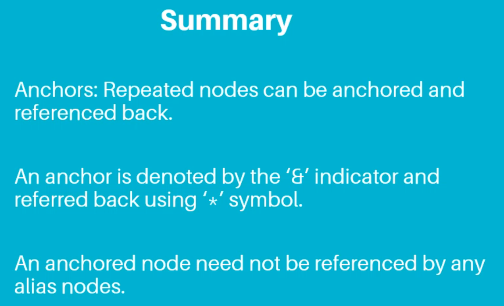
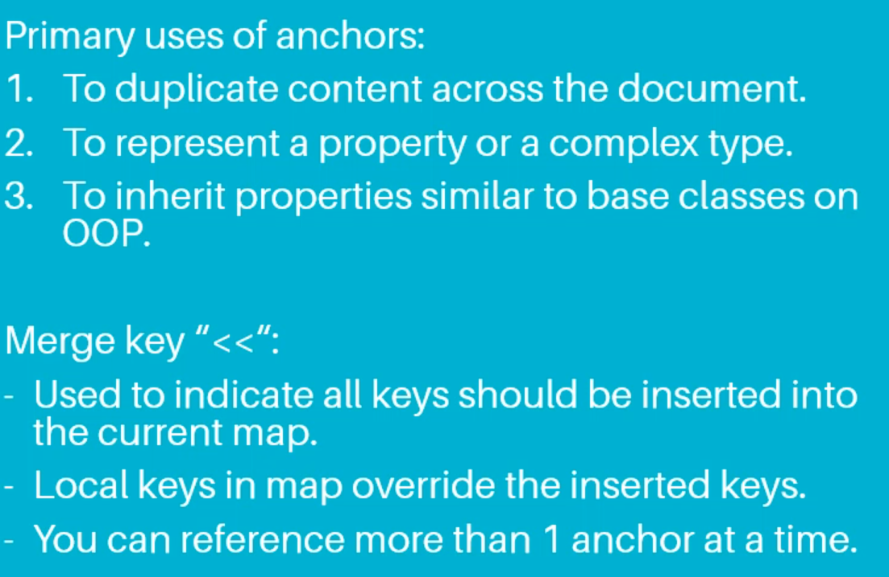
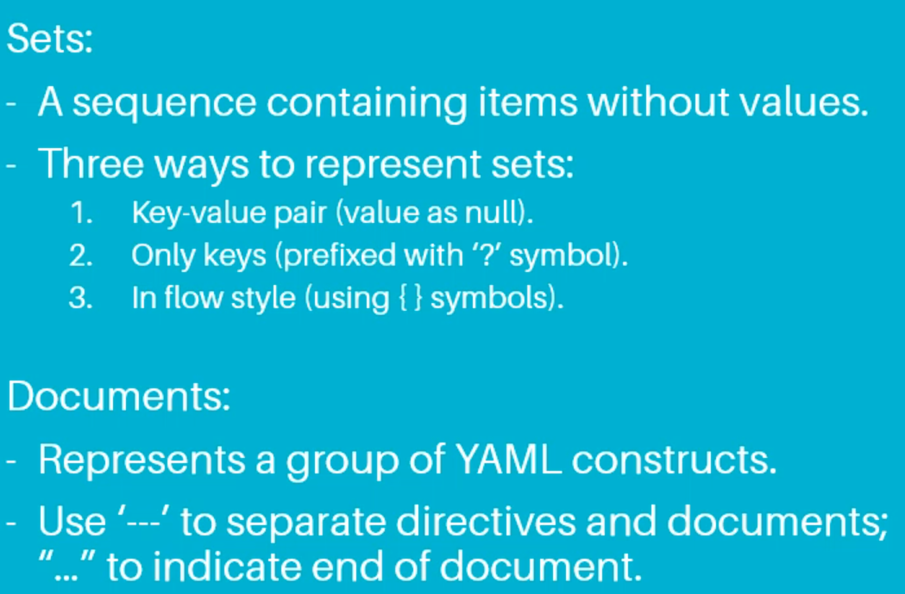
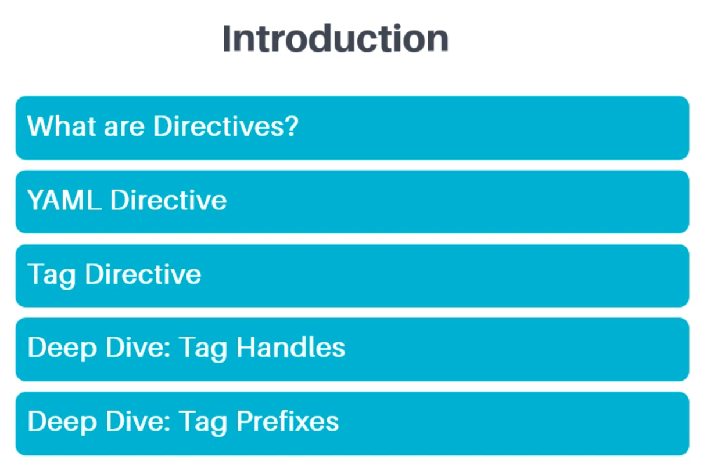
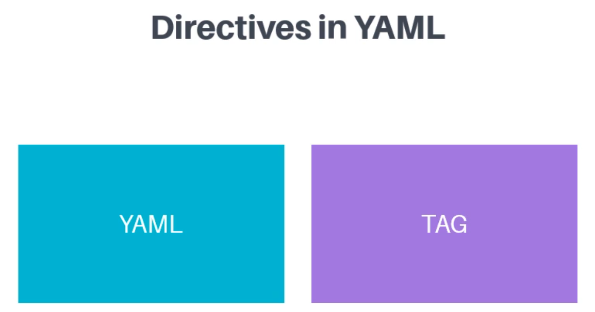
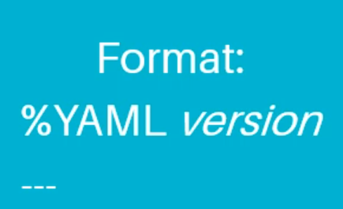
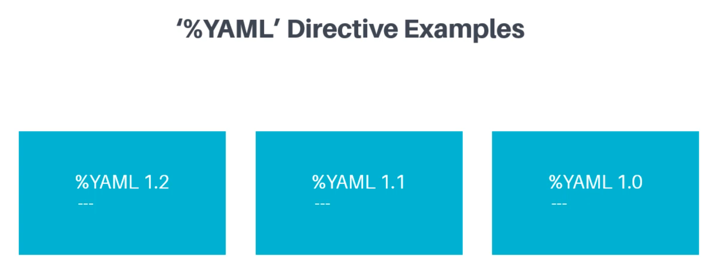

# 02 Getting Started with YAML => 010 Summary

# 03 Building Blocks of YAML => 008 Summary

# 04 More YAML Features => 009 Summary

# 05 Directives & Tags in YAML

# 001 Introduction

# 002 What are Directives in YAML_

# 003 YAML Directive

