# 02 Getting Started with YAML => 010 Summary

# 03 Building Blocks of YAML => 008 Summary

# 04 More YAML Features => 009 Summary

# 05 Directives & Tags in YAML

# 001 Introduction

# 002 What are Directives in YAML_

# 003 YAML Directive

# 004 Tag Directive

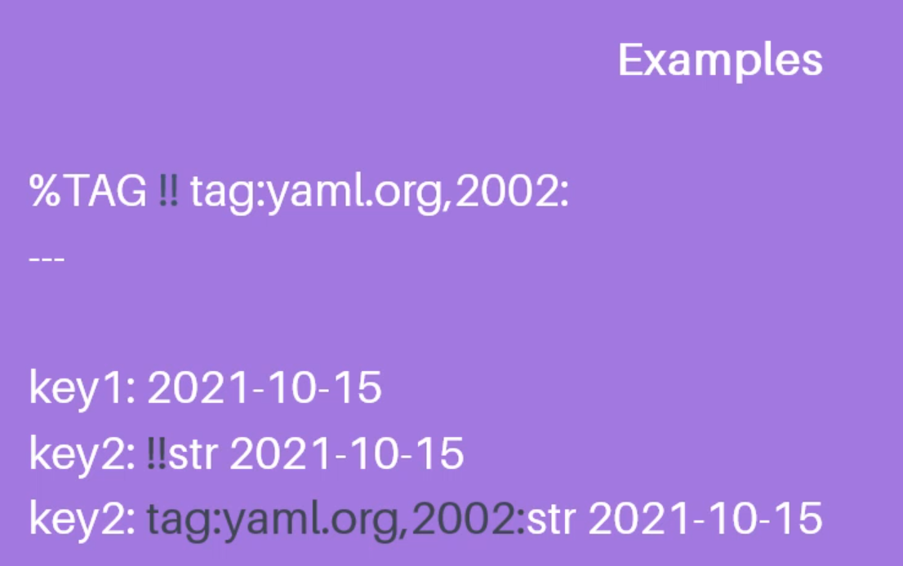

# 005 Deep Dive_ Tag Handles
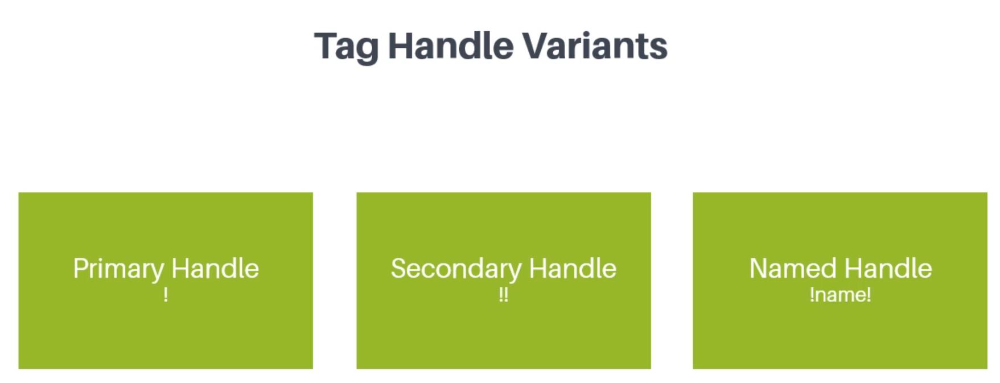
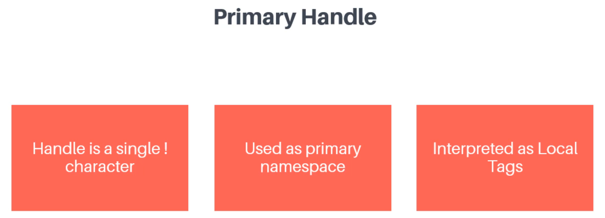

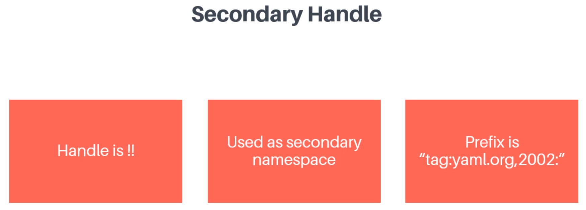

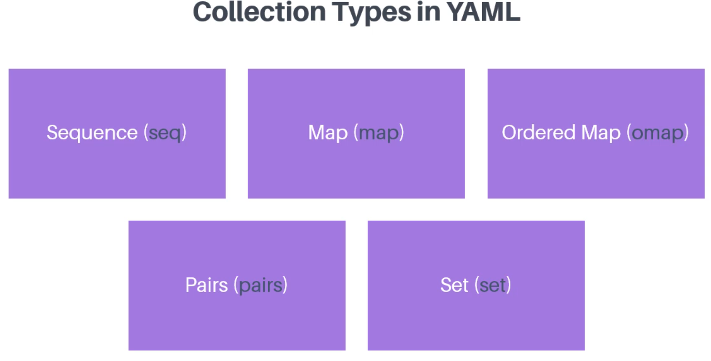
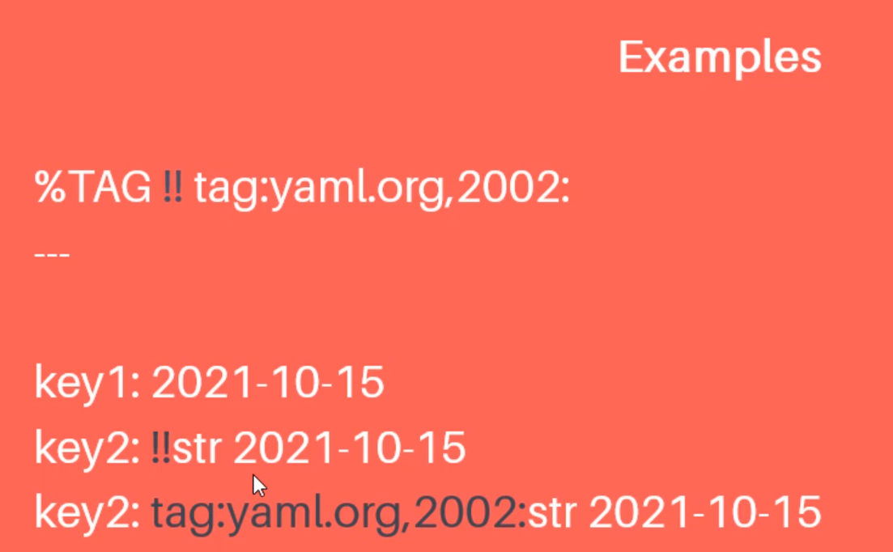
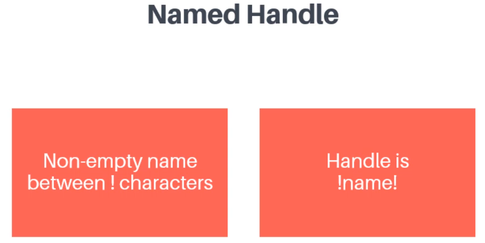

# 006 Deep Dive_ Tag Prefixes
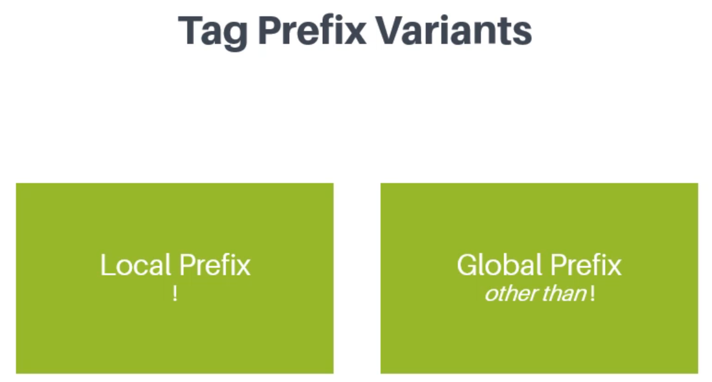
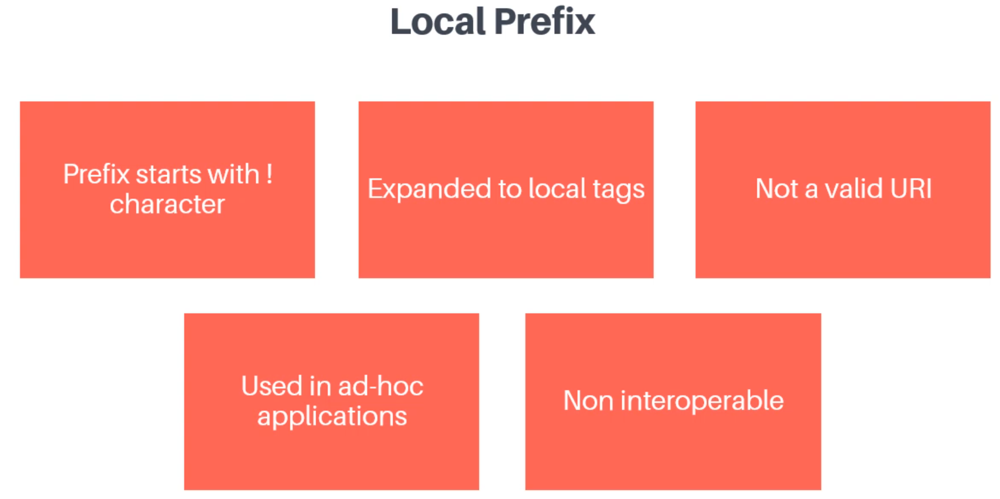

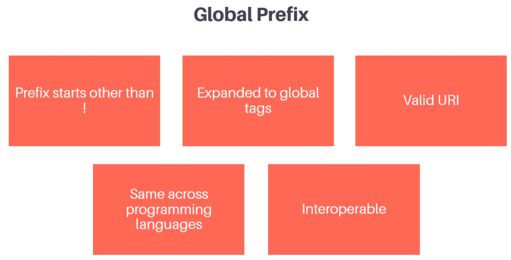
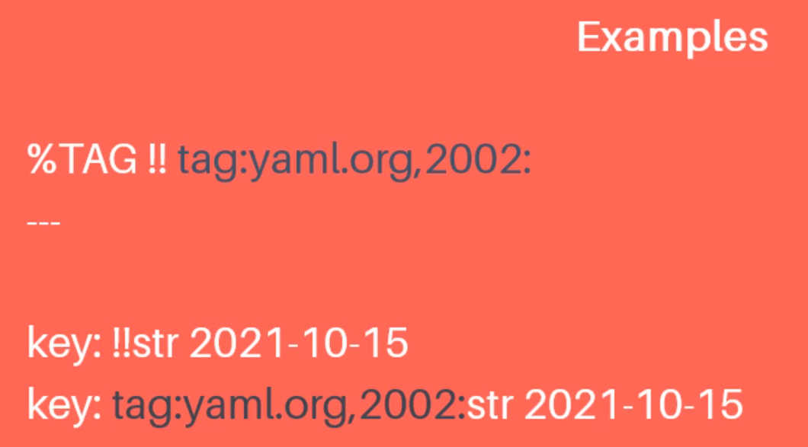

# 007 Summary
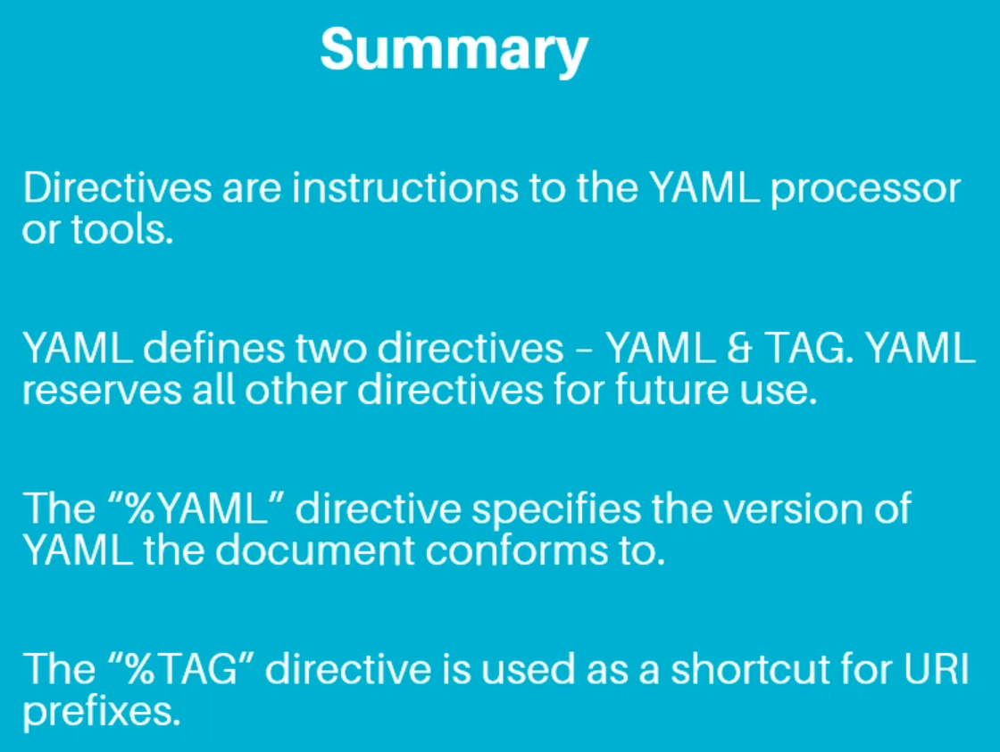
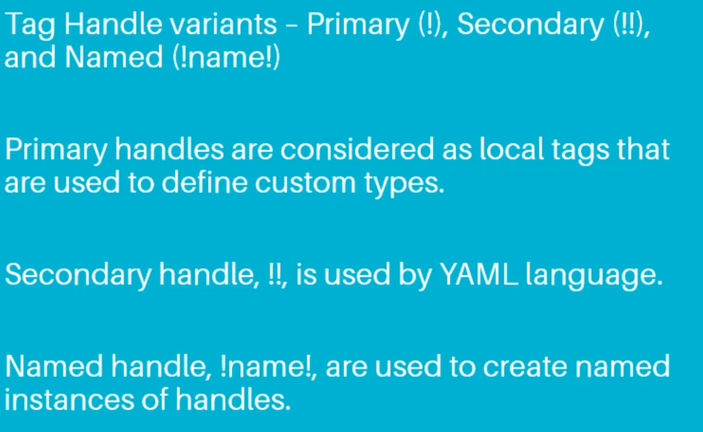
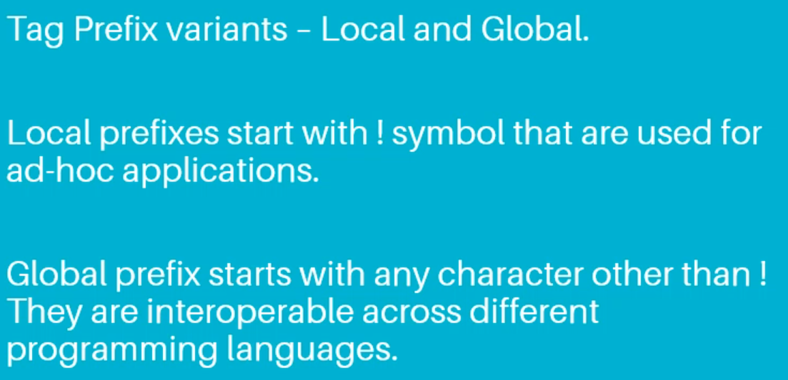

# NOTE
# !!str says whatever value it comes it is gonna conver that value to string.
    studentId: !!str 130