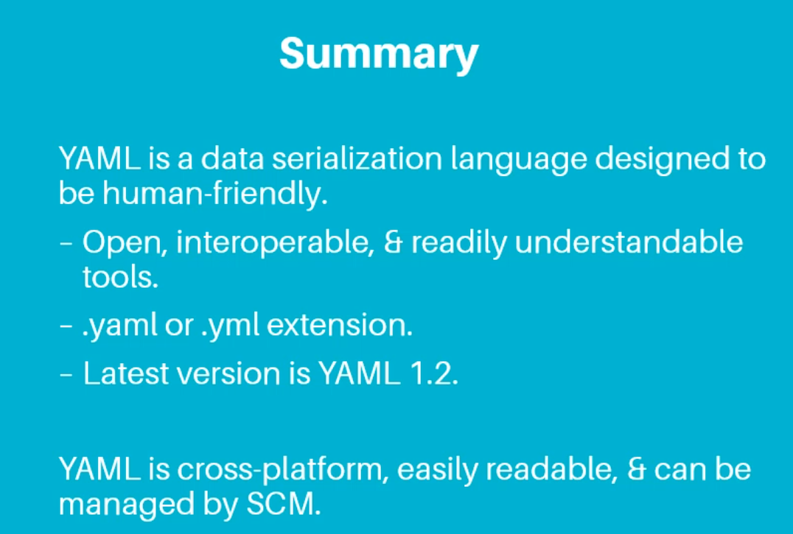
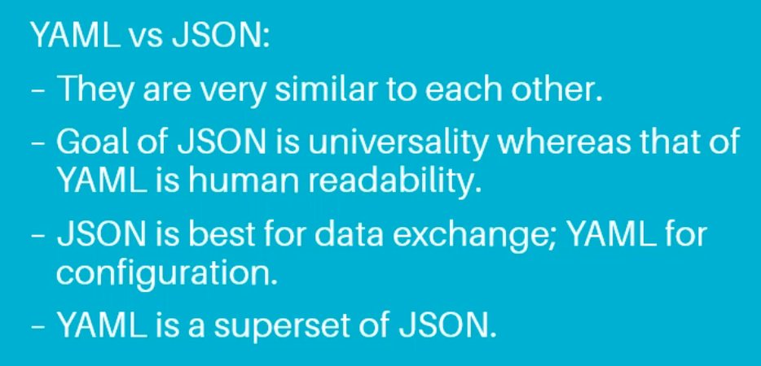
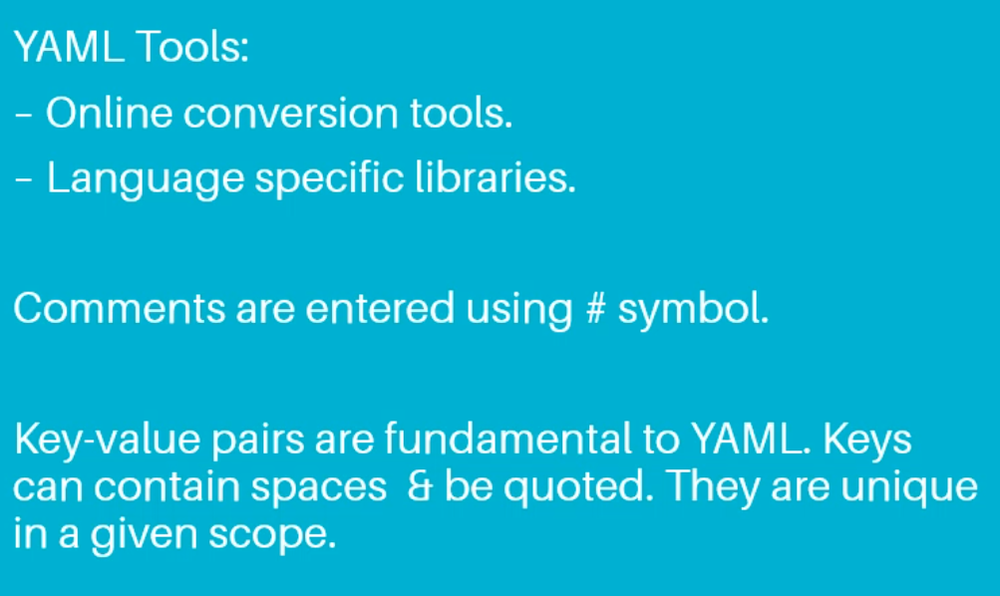
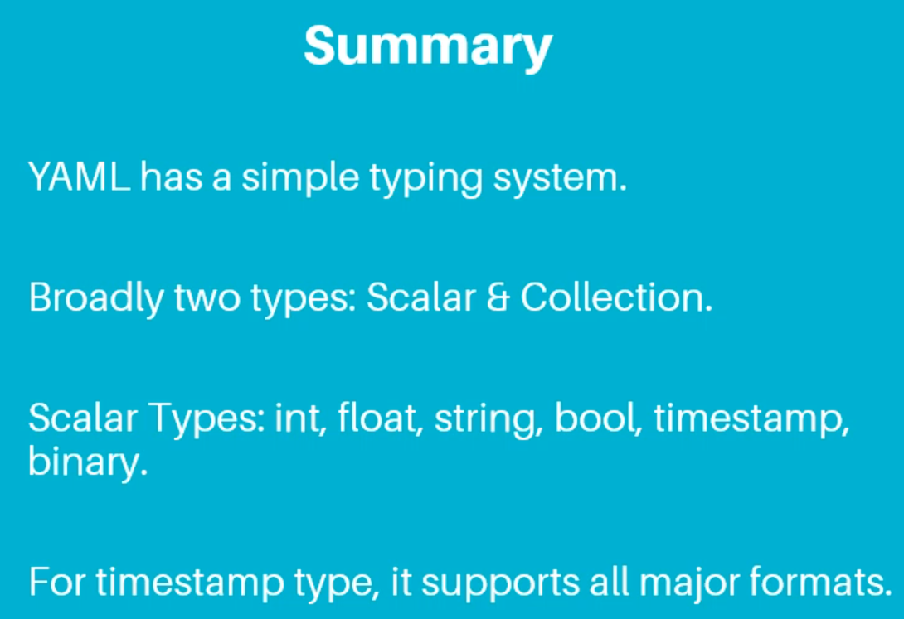
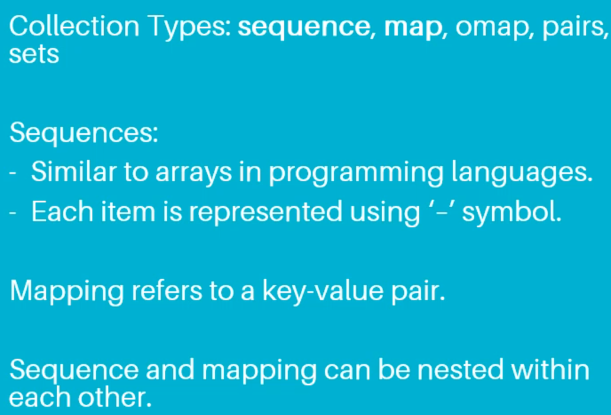
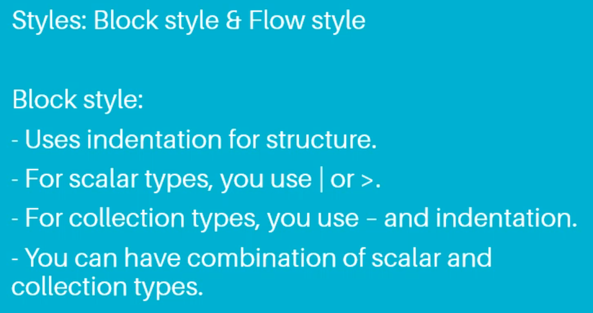
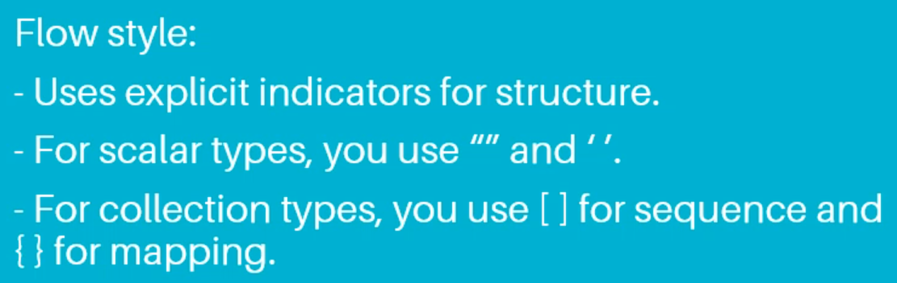
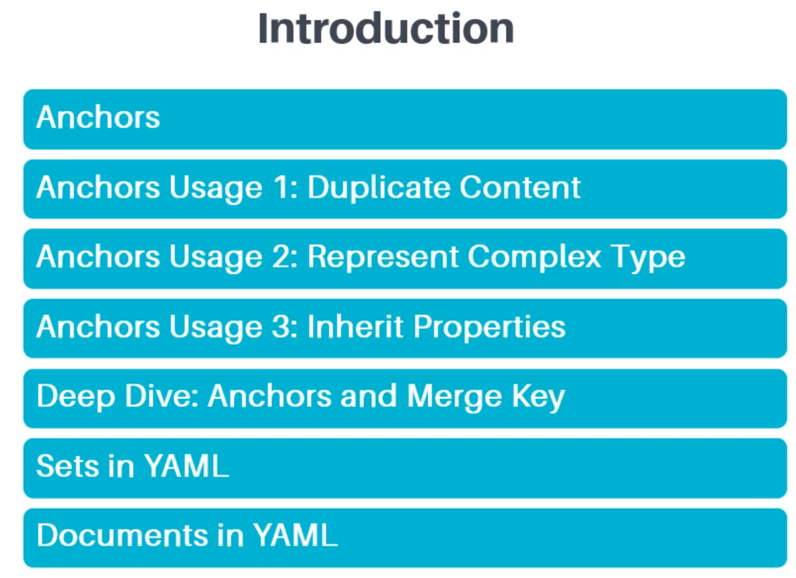
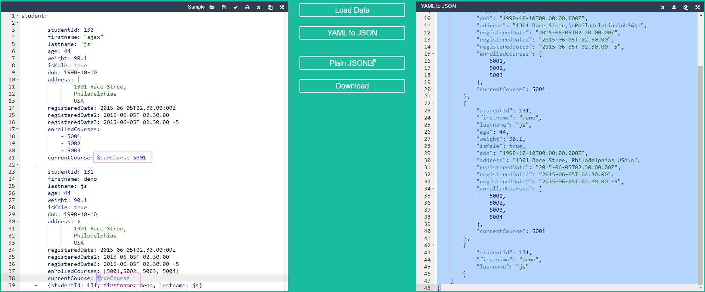

# 02 Getting Started with YAML => 010 Summary

# 03 Building Blocks of YAML => 008 Summary

# 04 More YAML Features
# 001 Introduction

# 002 Anchors

# 003 Anchors Usage 1_ Duplicate Content
